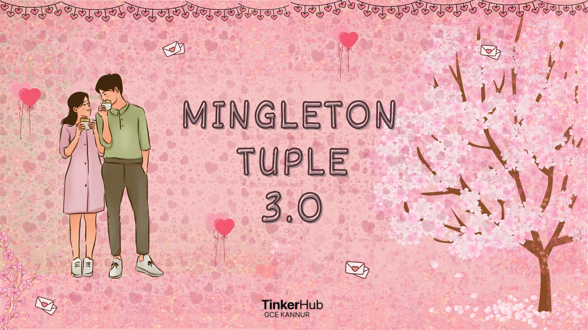
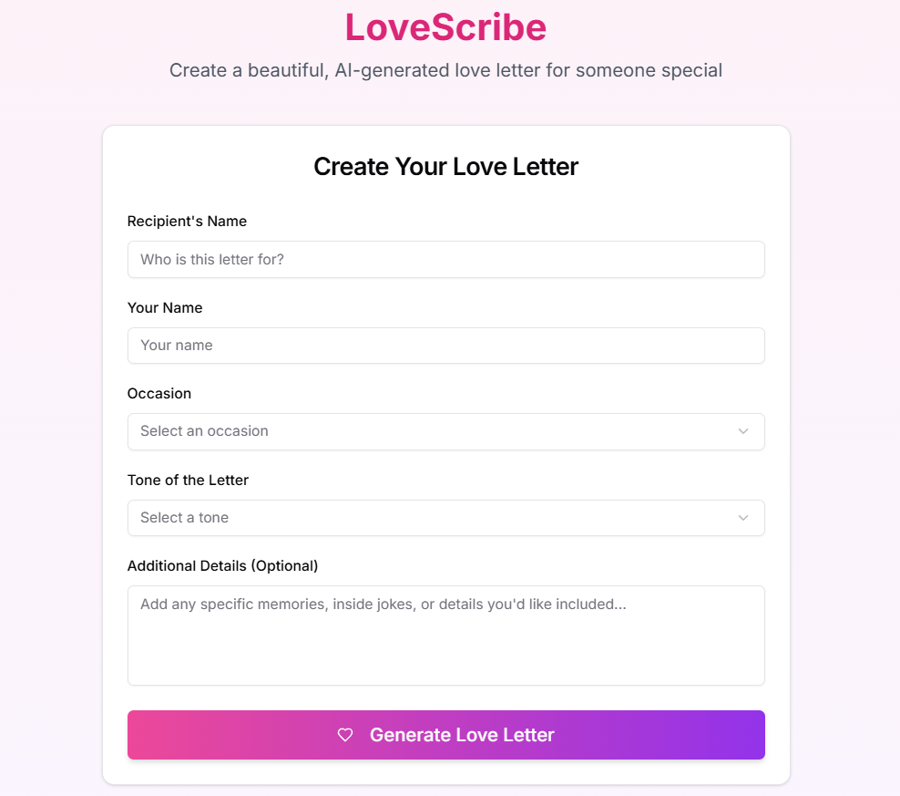
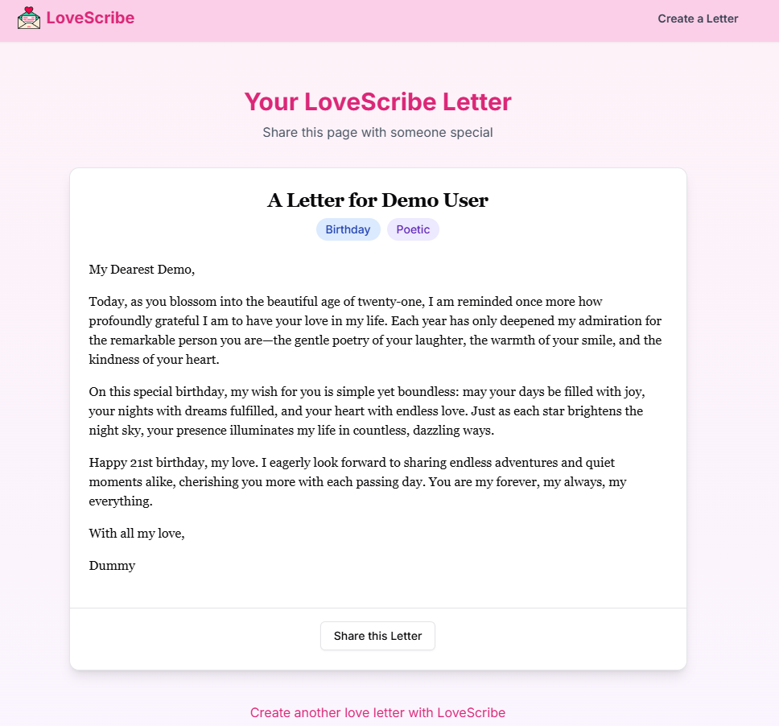
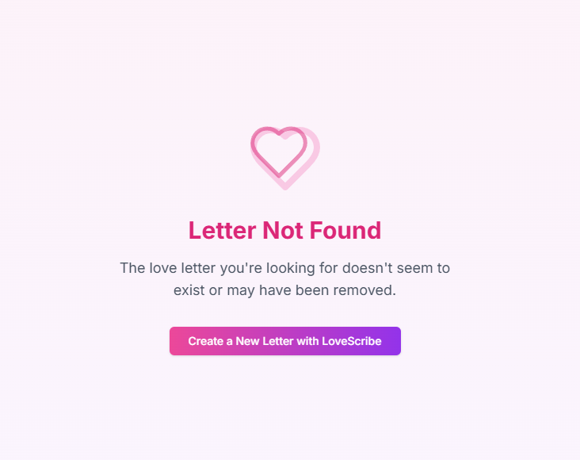

# LoveScribe 🎯

## Basic Details

### Team Name: Zephyr

### Team Members

- Member 1: Nandhu Krishnan A - CUSAT - Frontend
- Member 2: Nandhana VP - Jyothi Engineering College - Backend

### Project Description

LoveScribe is an AI-powered love letter generator that helps users create personalized, heartfelt messages for their loved ones. Using advanced AI technology, it crafts unique letters based on your specific occasion, tone, and personal details, making it easier to express your feelings in a meaningful way.

## Technical Details

- **Languages:** JavaScript, CSS, HTML
- **Frameworks:** Next.js 14, React 18, TailwindCSS
- **Libraries:** OpenAI API, Mongoose, ShadCN UI
- **Tools:** MongoDB Atlas, VS Code, Git

### Implementation

### Features

- 🎨 Beautiful, responsive UI with dark mode support
- ✨ AI-powered letter generation using OpenAI
- 💾 Persistent storage with MongoDB
- 🔗 Shareable letter links
- 📝 Multiple occasions and tones
- 🎯 Customizable additional details

## Installation

1. Clone the repository
   ```bash
   git clone https://github.com/nandhu-44/love-scribe.git
   cd love-scribe
   ```

2. Install dependencies
   ```bash
   npm install
   ```

3. Set up environment variables
   ```bash
   # Create a .env.local file with:
   MONGODB_URI=your_mongodb_connection_string
   OPENAI_API_KEY=your_openai_api_key
   ```

## Run

Development server:
   ```bash
   npm run dev
   ```

Production build:
   ```bash
   npm run build
   npm start
   ```

## Screenshots (Add at least 3)


_The homepage with the letter generation form_


_Generated letter with sharing options_


_404 Page if letter nor found_

## Project Demo

### Video

[Watch demo](https://drive.google.com/file/d/1NW8x3eKDGEWdmCqU6KMB4oJ-RXGvxkd7/view?usp=drivesdk)

_A walkthrough of LoveScribe's features including letter generation, different occasions and tones, and the sharing functionality_

---


